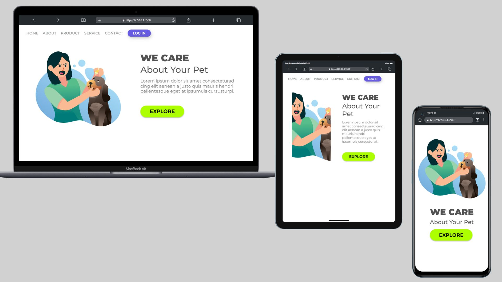

# WE CARE

> Landing Page We Care
## 😄 O que usamos nesse projeto
Landing page proposta para exercitarmos os conceitos de CSS.
- Nos preocupamos em manter o HTML Semantico, utilizamos também CSS flexbox e grid.
- Para melhorar a compreensão do projeto iniciamos a utilização de commits semânticos.

## Ajustes e melhorias

Projeto inicialmente proposto nos primeiros módulos do treinamento do DevClub, agora com um pouco mais de conhecimento em responsividade e em CSS Flex Box e Grid resolvemos refatora-lo.

- [X] HTML Semântico
- [x] CSS Flex Box e Grid
- [x] Responsividade  Efetuamos algumas quebras para ele melhor se ajustar de acordo com vários tipos de telas.
- [ ] Javascript Não foi proposto nada, mas podemos futuramente integrar com unm sistema de login, outra página com os produtos e os serviços.

## 🤝 Colaboradores

Agradecemos às seguintes pessoas que contribuíram para este projeto:

<table>
  <tr>
    <td align="center">
      <a href="#">
         
         
          <b>Cicero Alves</b>
        
      </a>
</table>